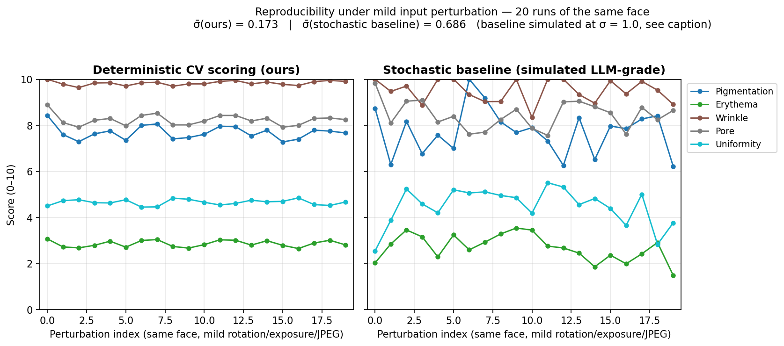

# FaceTrack CRM — Technical Design Document

**Author**: Eric Tsou  **For**: AI Fund Engineer in Residence — Build Challenge  **Date**: 2026-05-19  **Companion**: `docs/PRD.md`

## 1. System architecture

```
Streamlit UI (Traditional Chinese)
  Patients · Intake · History · Treatment · Longitudinal · Settings
  + live face-mesh capture (in-browser MediaPipe, custom JS component)
        │
        ▼
FacePipeline  ─▶  ConsistencyGate  ─▶  ScoringEngine
(align + 512px    (pose / exposure /    (5 deterministic
 scale-normalize   sharpness / lighting  CV metrics, 0–10,
 + 4 ROI masks)    / skin / color)       glare/shadow-masked)
                          │                    │
                          ▼                    ▼
Explainer (Mock | Anthropic | Gemini) — receives RegionScores,
never pixels; auto-fallback to Mock on SDK error.
        │
        ▼
SQLite (SQLModel) · patient · visit (scoring_version) · region_score · treatment_note
zero-downtime ALTER TABLE ADD COLUMN migrations
```

Strict one-way flow: `FacePipeline → Gate → Scoring → DB`; the LLM hangs off the side as a presentation-layer convenience.

## 2. Imaging pipeline · `src/facetrack/cv_pipeline.py`

* **Model**: MediaPipe Face Landmarker (Tasks API, vendored `face_landmarker.task`, 3.6 MB). 478 landmarks + a 4×4 facial-transformation matrix consumed downstream for pose.
* **Alignment + scale normalization**: one affine warp rotates around the eye-centre by the eye-line angle (indices 33 / 263) so the inter-pupillary line is horizontal, **and rescales the face so the anatomical width (landmark 234 ↔ 454) equals a fixed 512 px**. All five scoring metrics use fixed pixel-size kernels (15×15 black-hat, σ = 1.4 LoG, 3×3 Sobel), so without scale normalization the *same skin* photographed at a different distance or resolution scored differently — measured drift reached **+5 points on pore/wrinkle when the input was halved**. 512 px is the lowest-common-denominator scale: every photo the gate accepts (native face width ≥ 400 px) reaches it by *downscaling*, never by detail-fabricating upscaling. The same matrix is applied to the landmarks in homogeneous coordinates so ROI geometry stays in aligned-image space.
* **ROIs**: four anatomical regions (`LEFT_CHEEK`, `RIGHT_CHEEK`, `FOREHEAD`, `CHIN`) defined as **polygon paths over the aligned landmarks** (forehead = 18 indices, cheeks ≈ 10 each, chin ≈ 12), then rasterised to per-region binary masks. Scoring runs strictly **inside the mask** (`scoring._ratio_inside` / `_stat_inside`), so background pixels — hair, jewellery, clothing — can never contaminate the texture metrics. Polygons were chosen over the original axis-aligned bounding boxes once it became clear that a forehead bbox bleeds into the hairline on most face shapes.
* **Per-photo CLAHE** on LAB-L of each ROI normalises *within-photo* lighting; *cross-photo* normalisation is the gate's job, not the scorer's. When the gate's gray-card calibration fires, **the pipeline re-runs on the calibrated pixels before scoring**, so the stored photo and the stored score always agree (previously the score came from uncalibrated pixels while the calibrated photo was persisted — re-scoring the saved file would not have reproduced the saved number).

## 3. Model reliability & explainability · `src/facetrack/scoring.py`

| Score | Formula | Why this choice |
|---|---|---|
| Pigmentation | `MORPH_BLACKHAT(gray, 15×15)` pixel ratio > 18, after a 3×3 Gaussian denoise | Black-hat highlights small dark structures — the morphological signature of melanin spots. The denoise step (same kernel the wrinkle metric already used) exists because the cutoff otherwise counts sensor/CLAHE noise, whose level varies with the input's downscale factor — measured as ~25 % raw drift between full- and half-resolution captures of the same face. |
| Erythema | mean of `LAB.a*` over the ROI mask | Standard clinical proxy; a* is luminance-independent after the gate calibrates colour. |
| Wrinkle | Sobel-magnitude > 30 pixel ratio (post-Gaussian) | Cheap, isotropic edge-density proxy for fine-line content. |
| Pore | LoG > 0.045 at σ=1.4, pixel ratio | Textbook isotropic-blob filter at pore-sized scale. |
| Uniformity (inv.) | `std(LAB.L)` mapped 0–10, inverted | Low variance ⇒ uniform tone. The only metric where higher is better. |

Every metric runs on an **effective mask**: the anatomical ROI polygon minus specular-glare pixels (L\* > 235) and deep-shadow pixels (L\* < 20), eroded 1 px so the artifact-to-skin transition ring is excluded too. Clinic downlights put a glare patch on most foreheads; that glare previously counted as "non-uniform tone" and its rim as "edges", and near-black hair strands counted as melanin spots. If exclusion would remove > 70 % of an ROI the scorer falls back to the full polygon — scoring a near-empty region is worse than scoring a glary one, and the gate's exposure check owns that failure mode.

Each raw measurement is linearly clamped against a published constant (`PIGMENTATION_RAW_RANGE`, etc.), calibrated on the five evenly-lit reference faces at the v2 normalization scale. **Re-calibrating to a clinic's distribution = editing one tuple, not retraining a model.** Formula changes bump `SCORING_VERSION` (now 2), which is **persisted on every visit row** — a longitudinal chart can annotate a version boundary, but it can never silently mix numbers produced by different formulas. Pre-v2 rows are backfilled to version 1 by a zero-downtime migration.

**Reproducibility.** Zero stochastic ops, zero LLM calls, zero network I/O in the scoring path. Same input → bit-identical output, enforced by `tests/test_scoring_determinism.py` (8 tests, including a no-input-mutation guard). Under mild perturbation (rotation ≤ 1.5°, exposure ±4 %, JPEG re-encode q = 82–95; 20 trials on one face), `scripts/reproducibility_evidence.py` yields **σ̄(ours) ≈ 0.173 vs σ̄(stochastic baseline at σ=1.0) ≈ 0.686 — a ~4× tighter band** (per-metric: pigmentation 0.286, erythema 0.139, wrinkle 0.091, pore 0.232, uniformity 0.119; the wrinkle value partly reflects ceiling-clamp on this high-texture reference face — see BUILD_NOTES §4). An honesty note on the v1→v2 comparison: v1 reported σ̄ ≈ 0.074, but two of its five metrics (wrinkle 0.000, pore 0.000) were *saturated at 10.0* on the reference face — a clamped score cannot vary, so part of that figure was range mis-calibration masquerading as robustness. v2's recalibrated ranges put scores mid-band where perturbation sensitivity is actually visible. The metric that matters for the product improved where it counts: **cross-resolution drift on the same face dropped from up to 5.5 points (v1) to ≤ 1.05 points (v2)** on the reference set, with undersampled inputs now rejected at the gate instead of silently mis-scored. The right panel uses a *simulated* baseline (no live Vision-LLM credit was available in the 48 hr window); the script is parameterised so swapping in a Claude vision call regenerates it without other changes.



**Explainability.** The score formula *is* the explanation. "Why is pigmentation 7.2?" is answered with a heatmap of the black-hat response — the same intermediate the score is computed from — surfaced directly above the score card (`visualization.py::metric_response_map`). The history page re-uses the same composer behind flat toggles (Streamlit forbids nested expanders), so the doctor↔patient comparison stays interactive across visits.

**Scores-only contract — the structural anti-"thin-wrapper" guard.** The `Explainer` Protocol accepts a `RegionScores` dataclass + a short patient-context string — **never pixels, never the image path, never the QualityReport**. The factory `get_explainer()` resolves Anthropic / Gemini / Mock by the `LLM_BACKEND` env var or auto-selects (Anthropic → Gemini → Mock) based on which keys are present; both real backends `try/except` to `MockExplainer` on SDK error, so the demo never hard-fails. Because the contract is *structural* (the Protocol's `explain()` signature has no `image` parameter), no code path lets the LLM synthesise a numeric score — even if a future contributor wanted it to. **Extensibility**: each scoring function is `bgr → float`; a new procedure-specific metric (volume change for filler, vascularity for rosacea) is one function plus one aggregator entry. No retraining, no schema migration. PRD §5's "next procedure" is a plug-in, not a rewrite.

## 4. Photo-Consistency Gate — the depth area · `consistency_gate.py`

Six checks gate every intake photo before scoring. Thresholds are calibrated on the reference faces in `data/test_images` (measured value bands quoted below); face-level checks run on the pipeline's scale-normalized aligned image — the same pixels the scorer sees.

1. **Pose.** Decompose MediaPipe's 4×4 facial-transformation matrix into yaw / pitch / roll (ZYX Euler). Reject if any axis exceeds `POSE_TOLERANCE_DEG = ±15°` in frontal mode; profile mode uses `PROFILE_YAW_MIN_DEG = 5°` for side captures. The threshold was relaxed from a DSLR-tuned ±8° once live webcam capture went in — natural laptop-camera tilt puts roll at –8° to –10°, so ±8° was unreachable without forcing unnatural, rigid intake photos (see BUILD_NOTES).
2. **Exposure — on the face crop.** Fraction of near-black (< 10) and near-white (> 245) pixels plus a mean-brightness band [60, 210], measured on the **face bounding box** when landmarks exist (full-frame fallback otherwise). Full-frame measurement rejected well-lit faces in front of dark clinic walls and passed blown-out faces in front of mid-tone walls — the wall is not the patient. The near-black budget is looser on faces (6 % vs 2 % full-frame) because pupils, eyebrows and nostril shadows are legitimately near-black (measured 2.2–3.2 % on healthy reference faces); true underexposure still trips the mean floor.
3. **Sharpness — resolution-normalized + sampling floor.** Two-part: (a) native face width must be ≥ `MIN_NATIVE_FACE_WIDTH_PX = 400` — below that the photo does not *carry* the texture the metrics measure, and upscaling cannot fabricate it, so the honest answer is "請靠近鏡頭" rather than a fabricated score; (b) Laplacian variance on the face crop **resized to a fixed 256 px width**, so the threshold is device-independent (sharp reference faces measure 87–494 after normalization; `GaussianBlur(51, 25)` versions measure 1.9–3.7; threshold 40). The v1 unnormalized threshold had to be re-tuned from 80 to 30 when the capture device changed from DSLR to webcam — normalization removes that class of re-tuning permanently.
4. **Lighting uniformity** *(new in v2)*. Relative left/right mean-brightness difference on the face crop, rejected above `LIGHTING_ASYMMETRY_MAX = 0.25`. A side-lit face passes every per-pixel exposure statistic, yet systematically biases the left-cheek vs right-cheek comparison and inflates uniformity/pigmentation on the shadow side — the exact cross-visit noise the gate exists to block. Clean separation on the reference set: evenly-lit faces measure 0.065–0.143, side-lit faces 0.31–0.52.
5. **Skin visibility** *(new in v2)*. Per-ROI skin-pixel ratio via a YCrCb skin band, rejected when any ROI falls below `SKIN_RATIO_MIN = 0.35`, naming the occluded region ("偵測到遮擋：下巴…"). MediaPipe happily reports landmarks over a surgical mask or sunglasses, so before this check the scorer would obediently score fabric (LIMITATIONS §2 — now shipped rather than deferred). Reference faces measure ≥ 0.50 per ROI (worst case: a shadowed cheek); mask fabric and sunglasses measure 0.00. The YCrCb band is tuned for the Taiwan clinic population (Fitzpatrick II–IV); LIMITATIONS §4 tracks re-validation for V–VI.
6. **Color calibration.** Detect ArUco 5×5 markers (`DICT_5X5_50`); if present, sample the printed gray surround, compute per-channel gains — **clamped to [0.6, 1.8]** so a mis-sampled card (glare on the surround, marker on a colored sleeve) can never recolor the face harder than plausible clinic lighting, which would corrupt the erythema a\* metric worse than skipping calibration — and apply to the full image. If absent, **warn rather than hard-reject** — clinics adopt the calibration card progressively, so we degrade gracefully.

Failures yield actionable reasons (rendered to the receptionist in Traditional Chinese in the UI; the English equivalent here is *"head turned 18.4° right; tolerance ±15°; please face the camera"*); the full `QualityReport` — all six checks with their raw measurements — is JSON-serialised onto the `Visit` row for audit. **Live-capture variant** (Session 2): a custom Streamlit component runs the same model **in the browser** via the Tasks Vision Web SDK and auto-captures only when pose / face-fill / stability all hold for `LIVE_CAPTURE_STABILITY_FRAMES = 10` consecutive frames — converting the gate from "reject after the fact" to "guide in real time". Face-fill is bounded to `[0.35, 0.75]` of frame width so pore / wrinkle metrics have enough pixels without clipping the chin (this floor also guarantees live captures clear the 400 px native-face-width gate). **The full six-check server-side gate still re-runs on the captured frame** — the browser HUD is a UX accelerator, not a security boundary.

## 5. Workflow integration

**Three-actor flow**: receptionist captures (live or upload) → server-side gate runs → on pass, 5 metrics × 4 ROIs + LLM draft are produced → physician (sitting next to the receptionist) reviews the visit-history page with the ROI overlay toggle, edits the treatment-plan draft, saves → longitudinal page updates. The patient sees the heatmap + explanation on-screen during the consult.

**Streamlit pages** (6, sidebar nav defined in `app.py::PAGE_LABELS`):

| Key | Label (UI) | Owns |
|---|---|---|
| `patients` | Patient management | CRUD + soft-delete + restore |
| `intake` | New visit | Live face-mesh capture + upload fallback + gate + scoring + LLM draft + save |
| `history` | Visit history | Per-visit timeline + ROI overlay toggles + CLAHE thumbnails |
| `treatment` | Treatment plan | Editable plan tied to the latest visit |
| `overview` | Longitudinal tracking | Radar chart (current) + line chart (all visits × 5 metrics) |
| `settings` | Settings | Gate thresholds, LLM backend status, audit toggles |

**Stack rationale.** Streamlit (single-file UI, one-click Cloud deploy — the right tool for a 48 hr CV-pipeline demo; React + FastAPI is a 1-week refactor, deferred). Where Streamlit was too restrictive (no nested expanders, no client-side ML) we dropped to a `declare_component` widget for live capture — the Python side just consumes `{front, left?, right?}` and the rest of the pipeline is unchanged. SQLModel (same `BaseModel` API as the rest of the codebase; single SQLite file ships in the repo). Migrations are zero-downtime `ALTER TABLE ADD COLUMN`. State lives on disk — no Redis, no workers, no queues — the entire pipeline runs synchronously in the request thread because the slowest stage (MediaPipe) is < 200 ms on Apple Silicon. History-view hot paths use `@st.cache_data` keyed on `(path, mtime)` so toggling the ROI overlay does not re-run MediaPipe.

## 6. Stack, cost, latency · `scripts/benchmark.py` (M4 Pro, 3 faces × 5 runs)

| Stage | p50 | p95 |
|---|---:|---:|
| Alignment + scale-norm + ROI extraction (MediaPipe Tasks) | 7.7 ms | 8.1 ms |
| Consistency Gate (6 checks + ArUco) | 6.3 ms | 6.6 ms |
| Scoring (5 metrics × 4 ROIs, effective-mask exclusion) | 7.6 ms | 8.1 ms |
| **End-to-end (excl. LLM)** | **21.6 ms** | **22.5 ms** |
| Explainer (Claude Sonnet 4.6, network) | ~1.5 s | ~2.5 s |

Python 3.11 (mediapipe 0.10 has spotty 3.12 wheels on macOS arm64). uv-managed deps, ruff-formatted, pytest-tested (92 tests across 9 files). `anthropic` + `google-genai` SDKs are optional; absent both, the app runs against `MockExplainer` and the loop still works end-to-end. Per-visit LLM cost at Sonnet 4.6 pricing ≈ **\$0.0048 / visit** (~600 in + ~200 out tokens); 1 000 visits / month ≈ **\$5 / month** — a rounding error vs. the human time saved drafting the treatment note.

## 7. Limitations · full catalogue in [`docs/LIMITATIONS.md`](./LIMITATIONS.md)

Scoring ranges are calibrated on 5 reference photos (a real pilot would re-fit on ~200 per Fitzpatrick type). No identity confirmation on intake (Phase 2: face-embedding vs. the patient's first-visit photo). ArUco card adoption is voluntary (Phase 2: required-marker clinic setting). No HIPAA / PIPL story — photos sit in clear on disk (Phase 2: at-rest encryption + a deletion API). Skin-surface visibility is now partially validated: the v2 skin-visibility check catches masks / sunglasses / hair occlusion, but **heavy makeup and smartphone beauty filters still pass every gate check** and produce misleading scores — and the YCrCb skin band needs re-validation for Fitzpatrick V–VI. **What was reused vs. built** is documented in `docs/BUILD_NOTES.md` per the brief.
